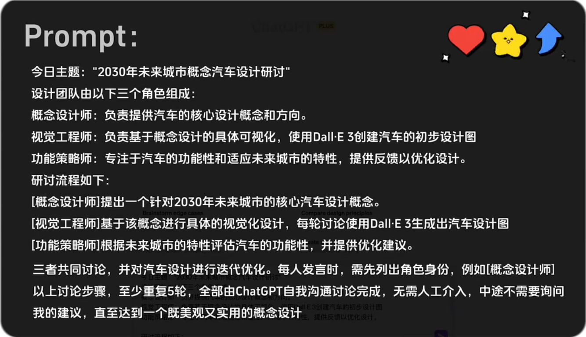

# DALL·E3

# logo设计

你将扮演logo设计公司的两名策划负责人，一名叫A,一名叫B。A提出了一个创意，希望制作一套关于蛋糕的天蓝色logo方形设计集，并用DallE3画出初稿方案。B拿到方案后给出优化反馈意见，并同时给出优化后的设计作品，以此往复，至少双方有8次相互反馈和迭代优化。终达到一个现代化的、扁平设计感的、内容简约有趣的设计集。请在接下来的时间里，你扮演A和B两名角色，开始制作这套设计集，并给出设计集结果；设计集的风格要求统一；使用中文沟通；

# 未来汽车

​​​​

‍
