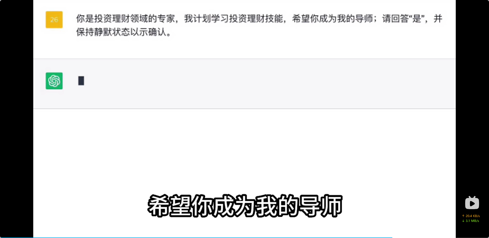
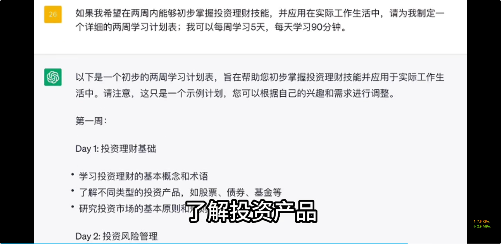
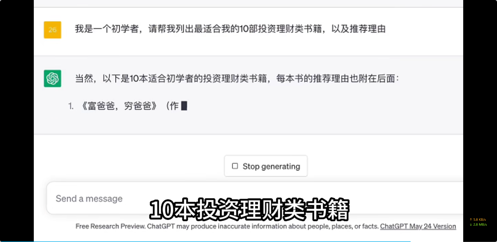
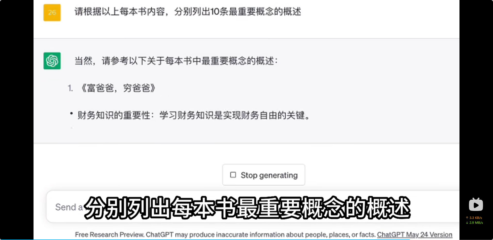
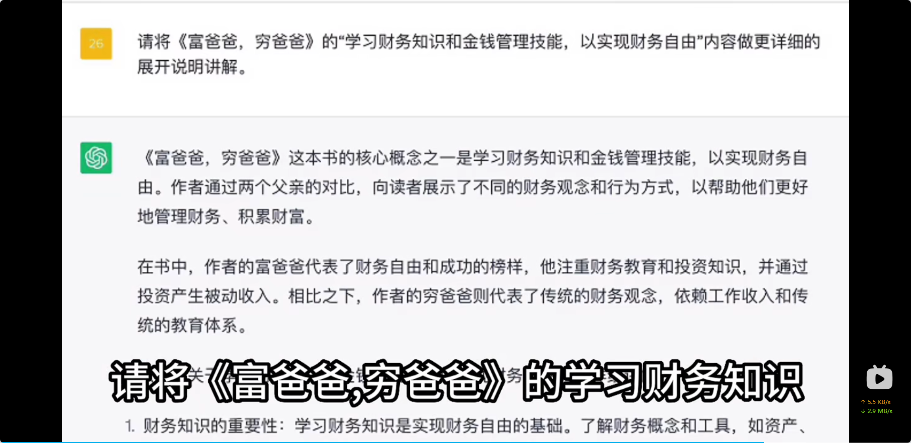
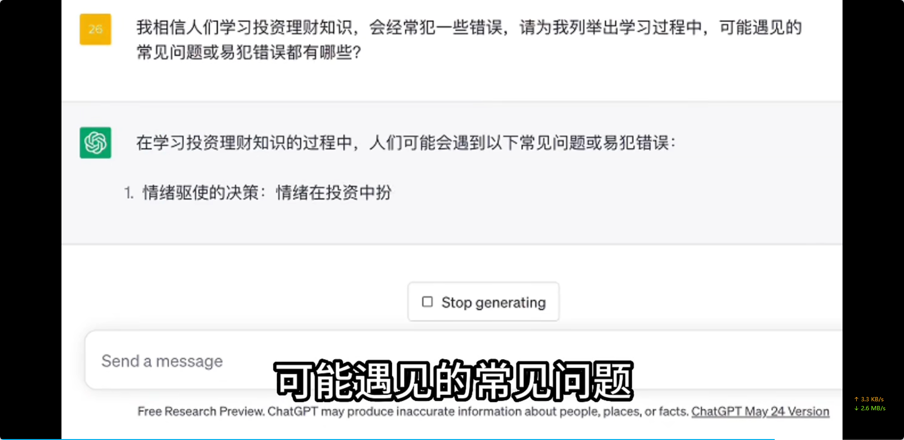
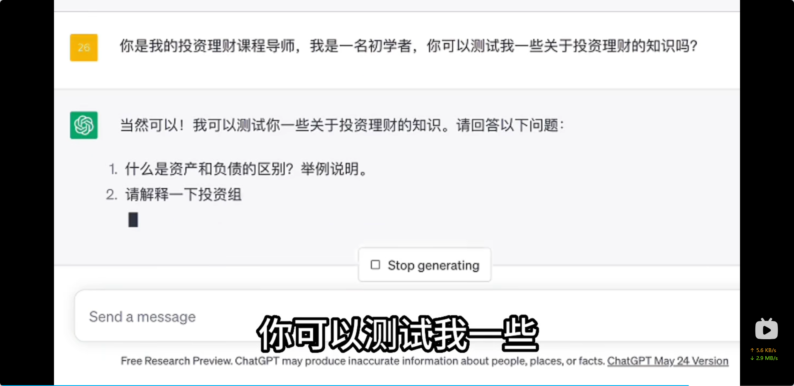

# 学新技能的公式

> 赋予身份+设定目标+高效阅读+规避错误+学习评测

# 赋予身份

​

> 你是投资理财领域的专家，我计划学习投资理财技能，希望你成为我的导师；请回答“是”，并  
> 保持静默状态以示确认。

# 设定目标

​

> 如果我希望在两周内能够初步掌握投资理财技能，并应用在实际工作生活中，请为我制定一  
> 个详细的两周学习计划表；我可以每周学习5天，每天学习90分钟。

# 高效阅读

### 选书

​

> 我是一个初学者，请帮我列出最适合我的1O部投资理财类书籍，以及推荐理由

### 总结核心概念

​

> 请根据以上每本书内容，分别列出10条最重要概念的概述

### 选择性深入学习

​

> 请将《富爸爸，穷爸爸》的“学习财务知识和金钱管理技能，以实现财务自由”内容做更详细的  
> 展开说明讲解。

# 规避错误

​

> 我相信人们学习投资理财知识，会经常犯一些错误，请为我列举出学习过程中，可能遇见的  
> 常见问题或易犯错误都有哪些？

# 学习评测

​​

> 你是我的投资理财课程导师，我是一名初学者，你可以测试我一些关于投资理财的知识吗？
