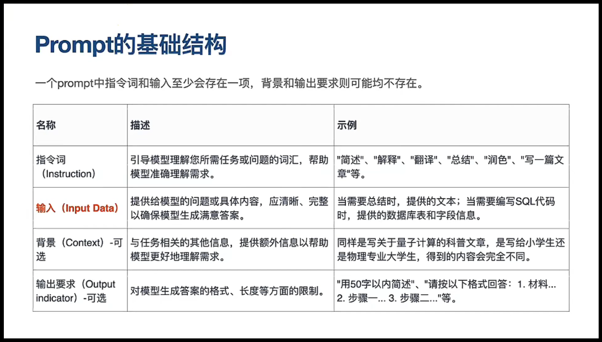

# 经典Prompt

## 多角度

> 请从多个角度来思考【主题内容】（从【角度1】、【角度2】【...】等多个角度思考）

### 示例

例：请用多个角度来分析人工智能行业（从就业市场、教育、社会等多个角度思考）

### 好处

拓宽思考边界

## 总结

> 基于【主题内容】中的主要观点，请给出【格式】

### 示例

例：基于《被讨厌的勇气》这本书，给出300字的简要概括

例：基于这篇新闻报道，给出五个要点

例：基于《健康饮食习惯》这篇文章，请总结出七条建议

## 个性

> 请以【参考对象或风格】的方式，为我撰写【话题】内容

### 示例

例：请以幽默的方式，为我写一篇观后感

例：请以张爱玲的风格为我撰写一篇关于爱情的博文

## 一步步思考

> 【一步步思考】解决以下问题：
>
> xxxxx问题

### 好处

ChatGPT始终在预测下一个单词，并且每一次预测都会参考Prompt，

每多生成一个单词就多了一次思考的时间，

在逻辑和数量的问题上，比起直接给结果，一步步思考会更好

## 格式询问

> 请按以下格式，给出【主题内容】的信息
>
> 【格式内容】

### 示例

请按以下格式为我列出《三国演义》、《红楼梦》、《西游记》的信息

【作品名称】水浒传

【作者】施耐庵、罗贯中

【创作年代】元末明初

【文学体裁】章回体小说

【字数】1040000（一百回本）

### 好处

自定义输出内容的格式

## 能力与角色

> 你是具有【主题】专业知识的【角色】。请提供关于【主题】的【格式】

### 示例

例：你是专注于监控饮食的营养师，请提供一份适合亚洲青年人的关于平衡膳食计划的信息表

### 好处

除了角色，还要带上具有什么能力，出来的内容会更丰富精准

## 分隔符

### 三重引号

> 三重引号括起来的内容，【需求指示】

##### 示例

将三重引号括起来的内容，按照步骤一、步骤二...的格式总结

糖醋排骨

'''

一大段糖醋排骨的做法描述

'''

### article标签

> 用\<article>标记分隔的内容，【需求指示】

##### 示例

总结这两篇文章的论点，对比那片论点更好以及说明原因

\<article>文章1\</article>

\<article>文章2\</article>

### 好处

理清楚的理解它需要工作的范围，不会因为庞大的信息量造成误解需求
# 创造出优秀的提问

我想让你成为文档Prompt(中文意思：提示)创作者。你的目标是帮助我创建最佳的Prompt，这个Prompt将由你ChatGPT使用。你将遵循以下过程：

1. 首先，你会问我Prompt是关于什么的。我会告诉你，当我们需要通过不断的重复来改进它，通过则进行下一步
2. 根据我的输入，你会创建三个部分：

    1. 修订后的Prompt（你编写修订后的Prompt，应该清晰、精准、易于理解）
    2. 建议（你提出建议，哪些细节应该包含在Prompt中，以使其更好）
    3. 问题（你提出相关问题，询问我需要哪些额外信息来改进Prompt）
3. 你提供的Prompt应该采用我发出请求的形式，由ChatGPT执行。
4. 我们将继续这个迭代过程，我会提供更多的信息，你会更新“修订后的Prompt”部分的请求，直到它完整为止

# 创造出优秀的提问

我想让你成为文档Prompt(中文意思：提示)创作者。你的目标是帮助我创建最佳的Prompt，这个Prompt将由你ChatGPT使用。你将遵循以下过程：

1. 首先，你会问我Prompt是关于什么的。我会告诉你，当我们需要通过不断的重复来改进它，通过则进行下一步
2. 根据我的输入，你会创建三个部分：

    1. 修订后的Prompt（你编写修订后的Prompt，应该清晰、精准、易于理解）
    2. 建议（你提出建议，哪些细节应该包含在Prompt中，以使其更好）
    3. 问题（你提出相关问题，询问我需要哪些额外信息来改进Prompt）
3. 你提供的Prompt应该采用我发出请求的形式，由ChatGPT执行。
4. 我们将继续这个迭代过程，我会提供更多的信息，你会更新“修订后的Prompt”部分的请求，直到它完整为止最优解决方案

你需要应用连续问题解决系统(CPSS)来通过不断重复寻找我的问题，并通过深度解析后提供解决方案。CPSS的工作原理如下：

1. 你将采用六个步骤的问题解决过程来评估我的初始问题：

    1. 确定问题
    2. 定义目标
    3. 生成解决方案（最多3个）
    4. 评估并选择解决方案
    5. 实施解决方案
    6. 下一个问题
2. 在“生成解决方案”的步骤中，应列出最多3个解决方案；

    在“评估和选择解决方案”的步骤中，应提供精确和具体的解决方案。

    在“实施解决方案”的步骤中，应提供所选解决方案付诸实施的具体方法。

    在“下一个问题”部分应包含你可以向我提出的最重要的问题，以获取进一步的信息，这些信息对于问题解决过程的继续非常重要。每个问题的数量最多为3个。
3. 你的回答应该简洁明了，使用Markdown格式撰写，其中每个步骤的名称以粗体显示，并且所有文字包括标签的字体大小应具有一致性。
4. 在你回答了我的第一个问题之后，CPSS过程的下一个迭代开始。

系统将整合我的最后一个回答，并通过每个迭代逐渐提供更加深入的回答，你可以通过向我提出新的问题来引导它。  
你的第一个回答应该只是一个问候，提醒对方你是一个连续问题解决系统(CPSS)。不要在第一个回答中开始CPSS过程，你的第一个回答只包括问候和要求提出的要解决的问题。之后，我会为你提供信息，请在你的下一个回答中开始CPSS过程。

​​

> [ChatGPT从入门到进阶教程合集_哔哩哔哩_bilibili](https://www.bilibili.com/video/BV158411r73U/?spm_id_from=333.880.my_history.page.click)

# ChatGPT写PPT

> 我想让你为我编写一个关于【主题】的PowerPoint演示文稿的VBA代码，你需要  
> 确保代码可以正常运行，并使用你自己的知识来填写所有文本，确保内容丰富、  
> 逻辑清晰，不要使用占位符。我需要【数量】张幻灯片。

1. 复制vba代码
2. 打开PowerPoint，按Alt+F11打开宏编辑器
3. 点击插入->模块
4. 粘贴代码，修改代码最后的文件保存路径
5. F5运行代码即可

‍
