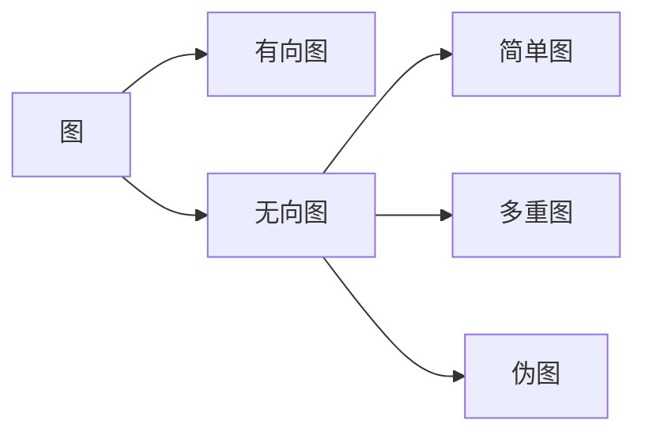

# 离散数学II
## 图

### 图的概述

图$G=(V,E)$是由非空顶点集$V$和边集$E$构成。每条边有一个或两个顶点与它相连，称为边的端点。

图的分类：

#### 无向图, Undirected Graph

|         类型         |  环  | 多重边 |
| :------------------: | :--: | :----: |
| 简单图(Simple graph) |  无  |   无   |
|  多重图(Multigraph)  |  无  |   有   |
|  伪图(Pseudograph)   |  有  |   有   |
分别为：                    简单图                                多重图                                伪图

#### 有向图, Directed Graph

有向图根据是否有**多重边**也可以分为 **简单有向图(simple directed graph)** 和 **有向多重图(dir.Multigraph)**。

### 图的术语, Graph Terminology

| 汉语       | 英语                          | 定义                                                     | 备注                       |
| -------- | --------------------------- | ------------------------------------------------------ | ------------------------ |
| 顶点       | Vertex                      | 图中的基本单位，用来表示点或节点。                                      | 通常用字母（如u, v, w）表示。       |
| 边        | Edge                        | 图中的基本单位，用来连接两个顶点。                                      | 可以是无向边或有向边。              |
| 邻接的/相邻的  | adjacent/neighbor           | 若 {u, v} 是无向图 G 的边，则两个顶点 u 和 v 在 G 中称为邻接（或相邻）。         | 对有向图，同样可以定义邻接关系。         |
| 关联       | incident                    | 边 e 关联顶点 u 和 v，也可以说边 e 连接 u 和 v。                       | e = {u, v} 或 (u, v)。     |
| 端点       | endpoint                    | 顶点 u 和 v 称为边 {u, v} 的端点。                               | 边的起点和终点。                 |
| 顶点 v 的邻居 | The neighborhood of v       | v 的所有邻居，用 $N(v)$ 表示。                                   | 邻居是与顶点 v 直接相连的顶点。        |
| 顶点的度     | degree of a vertex          | 在无向图里，顶点的度是与该顶点关联的边的数目。特殊情形是，顶点上的环为顶点的度做出双倍贡献。         | 与顶点相关联的边的数目，记作 $deg(v)$。 |
| 入度、出度    | in-degree, out-degree       | 入度 $deg^-(v)$ 是以 v 作为终点的边数；出度 $deg^+(v)$ 是以 v 作为起点的边数。 | 适用于有向图。                  |
| 基本无向图    | underlying undirected graph | 忽略边的方向后得到的无向图称为基本无向图。                                  | 可以从有向图转换而来。              |

#### 关于度

对于度为0的顶点，我们称它为**孤立的(Isolated)**；度为1的顶点称为**悬挂的(pendant)**。

使用 $\Delta(G) = max\{ deg(v) | v \in V \}$ 表示一个图的最大度数，$\delta(G) = min\{ deg(v) | v \in V \}$ 表示最小度数。

**握手定理**：

> [!tip] 即使出现多重边和环仍成立
> 只需要证明每条边都为顶点的度之和贡献为2.

根据握手定理，可以证明：无向图有偶数个度为奇数的顶点。

对于有向图，由于入度和出度的区别，有这个性质

>[!tip] 环对度的影响
>顶点上的环为顶点的度做出双倍贡献
>即同时拥有 1出度 ，1入度

#### 特殊的简单图

|    图    |  记号   |                                           性质                                           |       英语       |
| :-----: | :---: | :------------------------------------------------------------------------------------: | :------------: |
|   完全图   | $K_n$ |                                 每对不同顶点之间**都恰**有一条边的简单图                                 | Complete Graph |
|   圈图    | $C_n$ | 由$n$个顶点$n_1, n_2 ... n_k$组成的$n-1$条边$\{n_1,n_2\},\{n_2,n_3\},...,\{n_{k-1},n_k\}$围成的一个圈 |    Circles     |
|   轮图    | $W_n$ |                            给$n≥3$的全图添加一个新顶点，并且吧新顶点与原来全部顶点连接                            |     Wheels     |
| $n$立方体图 | $Q_n$ |                   用顶点表示$2^n$个长度为$n$的位串的图。两个顶点相邻，当且仅当它们所表示的位串恰怡有一位不同。                   |     n-Cube     |
|   正则图   |       |                            如果一个简单图的每个顶点都有相同的度，那么这个图就称为正则图。                             | regular graph  |

完全图

圈图

轮图

$n$立方体图

正则图

#### 二分图，Bipartite Graph

若把简单图$G$的顶点集分成两个不相交的非空集合$V_1$和$V_2$，使得图里的每一条边都连接着$V_1$里的一个顶点与$V_2$里的一个顶点，则$G$称为二分图。

**二分图的判定（涂色）**：

**一个简单图是二分图**，**当且仅当**能够对图中的每个顶点赋予两种不同的颜色，并使得没有两个相邻的顶点被赋予相同的颜色。
>[!tip] 简单二分图概念速记
>不能连接同一集合内的顶点

简单二分图

**完全二分图**：顶点集分成分别含有$m$和$n$个顶点的两个子集的图，两个顶点之间有边当且仅当一个顶点属于第一个子集而另一个顶点属于第二个子集（也就是集合内顶点之间没有边）。
>[!tip] 完全二分图概念速记
每个顶点必须连接到另一集合的所有顶点

完全二分图

二部划分可以被应用到匹配（matching）问题上。简单图 $G = (V,E)$ 中的匹配 $M$ (匹配)是图的边集 $E$ 的子集，使得没有两条边与同一顶点相关联。**最大匹配**(maximum matching)是边数最大的匹配。从$V_1$到V2的完全匹配(complete matching)，如果$V_1$中的每个顶点都是匹配中的一条边的端点，或者等效地，如果$|M| = |V_1|$。

**霍尔婚姻定理**：提供了一组存在完全匹配的充分必要条件：

### 匹配

A matching $M$ (匹配) in a simple graph $G = (V ,E)$ is a subset of the set $E$ of edges of the graph such that **no two edges are incident with the same vertex**.

- **最大匹配（Maximum Matching）**：A maximum matching (最大匹配) is a matching with the **largest number of edges**.
- **完全匹配（Complete Matching）**：A complete matching (完全匹配) from $V_1$ to $V_2$, if every vertex in $V_1$ is the endpoint of an edge in the matching, or equivalently, if $|M| = |V_1|$.

**完全匹配的充要条件（霍尔婚姻定理，P555）**：

### 新图的产生

#### 概括

- **子图(subgraph)**：点集和边集是原图子集的图。特别的，还有真子图(proper subgraph)

- **生成子图(spanning subgraph)**：**顶点与原图完全相同**，边集是原图子集的子图。

- **导出子图(subgraph induced by a subset)**：分为点导出子图和边导出子图

  > 设$V_1\subseteq V$，以$V_1$为顶点集，以端点均在$V_1$中的$E$中的边的全体为边集$E_1$，构成的子图，称为由$V1$导出的$G$的子图(点导出子图)，记为$G(V_1)$。设$E_1 \subseteq E$，以$E_1$为边集，以$E_1$中边的端点全体为顶点集构成的子图，称为由$E_1$导出的$G$的子图(边导出子图)，记为$G(E_1)$。
  
**并图**（The Union of graph $G_1$and $G_2$）：两个简单图 $G_1 = (V_1, E_1)$ 和 $G_2 = (V_2, E_2)$ 的并集是顶点集 $V = V_1 \cup V_2$和边集 $E = E_1 \cup E_2$ 的简单图。

**补图**（Complementary graph $\bar{G}$ of a simple graph $G$）：设 $G$ 是具有 $n$ 个顶点的简单图，从这 $n$ 个顶点构成的完全图 $K_n$中删去 $G$ 的所有边，但保留顶点集 $V(G)$ 所得到的图称为 $G$ 的补图， 记为 $\bar{G}$。

#### 通过操作边和顶点：
- 从图中删除或增加边

- 边的收缩(Edge contraction)

- 从图中删除顶点

### 图的表示和同构, Graph Isomorphism

#### 图的表示
图的表示有几种常用的方法：
- **邻接表，Adjacency list**
- **邻接矩阵，Adjacency matrice**：一种类型是基于顶点的邻接关系；另一种类型是基于顶点与边的关联关系。

> [!notice] 无向图的邻接矩阵总是对称的（包括伪图和多重图）
  > 图的邻接矩阵依赖于所选择的顶点的顺序
  > 对无向图来说，邻接矩阵每一行各个位置上数字之和代表与顶点 $i$ 关联的边数, 等于顶点 $i$ 的度减去在顶点 $i$ 上的环数（本质上是去重）；对于有向图而言，邻接矩阵每一行各个位置上数字之和代表该顶点的出度，每一列代表该顶点的入度。

- **关联矩阵，Incidence matrice**
> [!info ]
  在无向图中的关联矩阵中，每列中有两个 $1$ 的表明这条边与这两个顶点相连接，每列有一个 $1$ 的表明存在环

对于无向图来讲，邻接矩阵上每一行各个位置上数字的和表示与该顶点关联的边数，也就是他的度减去环的数量（去掉重复的贡献）；对于有向图来讲，每行的和表示该顶点的出度，每列的和表示入度。

#### 图的同构

>[!tip] 定义
两个图 $G_1 = (V_1, E_1)$和 $G_2 = (V_2, E_2)$是同构的，当且仅当：
>1. 存在一个双射（双向一一对应关系）$f: V_1 \to V_2$，使得：
>   $$\{u, v\} \in E_1 \iff \{f(u), f(v)\} \in E_2$$
>2. 也就是说，两个图的顶点和边的连接方式相同，仅节点名称或编号可能不同。

>[!info ] 省流
>当两个简单图同构时，两个图的顶点之间具有保持邻接关系的 一 一 对应。

在两个带 $n$ 个顶点的简单图顶点集之间有 $n!$ 种可能的一一对应，通过检验每一种对应来看它是否保持邻接关系和不邻接关系是不可行的。 然而，可以通过*说明两个简单图不具有同构的图所必须具有的性质来说明 它们不同构*，把这样的性质称为对简单图的同构来说的 **不变量**(invariants)。

重要的不变量包括：
- 相同的**顶点数**
- 相同的**边数**
- 相同的**顶点度**
- 相同的二分能力
- 当且仅当都是完成图
- 当且仅当都是轮图
- **连通分支的数目及大小**
- 当且仅当都具有相同长度的简单回路

> [!note]
> 图同构算法己知的最好的判定两个图是否同构的算法*具有指数的最坏情形时间复杂度* (对图的顶点数来说）。不过，解决这个问题的线性平均情形时间复杂度的算法已经找到，而且有希望，即使仍有怀疑，找到判定两个图是否同构的多项式最坏情形时间复杂度的算法。
### 连通性问题, Connectivity

术语区分（此处术语可能并不通用，括号是另一套术语）：

| 汉            | 英                        | 定义                                                                                                     | 备注                      |
| ------------ | ------------------------ | ------------------------------------------------------------------------------------------------------ | ----------------------- |
| **通路(路径)**   | **path(walk)**           | 图 $G$ 的一个**非空点、边交替序列**称为一条从 $v_0$​ 到 $v_k​$ 的通路                                                        | 点和边交替出现                 |
| **迹**        | **trail**                | 若一条通路中的边不重复，则称该通路为迹。                                                                                   | 边唯一                     |
| **回路(闭合路径)** | **circuit(closed walk)** | 如果 $v_0 = v_k$​，且通路长度大于 0，则称为一条回路                                                                      | 也叫闭迹，通路起点和终点相同且长度不为0    |
| **路线/简单通路**  | **trail**                | 若通路或回路不重复地包含相同的边，则称为简单通路或简单回路                                                                          | 也可以称为“迹”，是特殊的通路         |
| **端点**       |                          | 通路的起点和终点称为端点。起点为 $v_0$​，终点为 $v_k$​                                                                     | 端点是路径中第一个和最后一个顶点        |
| **内点**       |                          | 通路中除了端点外的顶点称为内点，即$v_1,v_2, \dots, v_{k-1}​$                                                            | 路径的中间顶点                 |
| **路长**       |                          | 通路所包含边的数量称为通路的长度，即通路的边数 k                                                                              | -                       |
| **路径的逆转**    |                          | 记 W 是一条从 $v_0​$ 到 $v_k$​ 的路径，逆转后的路径一定是从 $v_k$​ 到 $v_0$​ 的路径，记作$W^{-1}$                                 | 逆转后的路径依然是原路径的有效表示       |
| **节**        |                          | 通路 W 的部分相连项构成的子序列也必构成一条路径，这条路径称为 W 的节                                                                  | 通路的连续子序列                |
| **新的路径**     |                          | W 可以与另一条路径 W′ 衔接在一起便得一条新路径，记为 WW′                                                                      | 新路径必须符合顶点和边的连接规则        |
| **圈**        | **Circle**               | 设 $v_0, e_1, v_1, e_2, v_2, \dots, e_k,v_0$ 是一条简单回路/闭迹，如果 $v_0, v_1, \dots, v_{k-1}$ 互不相同，则称该闭迹为圈或 k 圈 | 当 k 为偶数时称为偶圈；k 为奇数时称为奇圈 |

名词重整
- 通路（path）：==顶点==和==边==交替
- 回路（circuit）：==起点==和==终点==相同
- 简单通路/迹（trail）：==边==不重复
- 初级通路/路：==点==不重复

**圈的性质定理**：

1. 若图$G$中每个顶点度数至少为２，则$G$中必含有圈。
2. $图G为二分图\Leftrightarrow G中不含奇圈$
   

距离：设$u, v \in V(G)$，若$u，v$连通，则称最短$(u, v)$路的长为$u, v$距离，记为$d(u, v)$。

> [!tip]
> 当$u，v$不连通时，认为$u，v$的距离是啊$\infty$

在**连通无向图**的每一对不同顶点之间都**存在简单通路**。

#### 分割与点、边连通度

- **割点(cut vertices)**：如果删除一个顶点和它所关联的边，就产生*比原图更多的连通分支的子图*时，这样的顶点称为割点(cut vertices)或关节点。从连通图里删除割点，就产生**不连通的子图**。
- **割边或桥(cut edge or bridge)**：如果删除一条边，就产生比原图更多的连通分支的子图时，这样的边称为割边或桥(cut edge or bridge)。

没有割点的图（例如完全图），被称为**不可分割图**（nonseparable graph）

设$V'$是顶点集$V$的子集，如果$G‒V'$是不连通的，则称$V'$是**点割集或分割集**(vertex cut, or separating set)。**除了完全图之外，每一个连通图都有一个点割集**。

- 一个图的点割集中*最小的顶点数*，称为**点连通度**(vertex connectivity)，记为$K(G)$，满足$0 \leq K(G) \leq n‒1$。K(G)是使G变成不连通的图*或只含有一个顶点的图*，所需删除的最小的顶点数。当$K(G)>=k$，则称图G是**k连通**的(k-connected)。

  > 对于不连通图和$K_1$，$K(G)=0$；对于含割点的连通图或$K_2$，$K(G) = 1$。

- 设$E'$是图G的边集$E$的子集，如果$G‒E'$是不连通的，则称$E'$是**边割集**(edge cut)。一个图的边割集中最小的边数，称为**边连通度**(edge connectivity)，记为$\lambda(G)$.

  > 对于不连通图和$K_1$，$\lambda(G)=0$；对于含割点的连通图或$K_2$，$\lambda(G) = 1$。

我们可以主观的看到，**点、边连通度越大整体的连通性越强**。

点连通度和边连通度的不等式）：

##### 1. 割点 (Cut Vertex)

- **定义**：在一个连通图中，删除某个顶点及其相连的边，导致图的连通分支数增加（即图变得不连通）时，这个顶点被称为**割点**（cut vertex）或**关节点**。
    
- **性质**：如果从一个连通图中删除一个割点，它会使图变得不连通或至少有更多的连通分支。
    
- **例子**：在一个树结构中，任何一个非叶子节点都是割点。
    

---

##### 2. 割边或桥 (Cut Edge or Bridge)

- **定义**：如果删除图中的一条边，导致图的连通分支数增加（即图变得不连通），则称这条边为**割边**（cut edge）或**桥**（bridge）。
    
- **性质**：如果一条边被删除后图的连通性变差，说明这条边是图的关键连通桥梁。
    
- **例子**：在树中，每一条边都是割边。
    

---

##### 3. 不可分割图 (Nonseparable Graph)

- **定义**：如果一个图中没有任何割**点**，即删除任何一个顶点或边都不会使图变得不连通，那么这个图被称为**不可分割图**（nonseparable graph）。
    
- **例子**：完全图是不可分割的，因为删除任何顶点或边都不会使其变得不连通。
    

---

##### 4. 点割集 (Vertex Cut)

- **定义**：设 $V′$ 是图 G 的顶点集 V 的子集。如果从图中删除 $V′$ 中的所有顶点后，图变得不连通（即 $G - V$'不连通），那么 $V′$ 就是图 G 的**点割集**（vertex cut）或**分割集**（separating set）。
    
- **性质**：点割集代表了图中最少的顶点集合，删除这些顶点后图会失去连通性。
    
- **例子**：在一个链式结构中，任何一个中间节点都是点割集。
    

---

##### 5. 点连通度 (Vertex Connectivity)

- **定义**：图 G 的点连通度 $K(G)$ **是最小的顶点数**，使得删除这些顶点后，图变得不连通或只剩下一个顶点。点连通度的值满足 $0≤K(G)≤n−1$（其中 nnn 是顶点的数量）。
    
- **性质**：点连通度越大，说明图的连通性越强，删除顶点越不容易使图不连通。
    
- **例子**：
    
    - 对于一个不连通图或 K1K_1K1​（单个顶点的图），点连通度 K(G)=0K(G) = 0K(G)=0。
    - 对于包含割点的连通图或 K2K_2K2​（两个顶点的完全图），点连通度 K(G)=1K(G) = 1K(G)=1。
- **k连通图**：如果 K(G)≥kK(G) \geq kK(G)≥k，则称图 GGG 是**k连通**（k-connected）。
    

---

##### 6. 边割集 (Edge Cut)

- **定义**：设 $E′$ 是图 G 的边集 E 的子集。如果从图中删除 $E′$ 中的所有边后，图变得不连通（即 $G−E′$ 不连通），那么 $E′$ 就是图 G 的**边割集**（edge cut）。
    
- **性质**：边割集代表了图中最少的边集合，删除这些边后图会失去连通性。
    
- **例子**：在树结构中，每一条边都是边割集。
    

---

##### 7. 边连通度 (Edge Connectivity)

- **定义**：图 G的边连通度 $λ(G)$ 是使得图变得不连通的最少边数。边连通度的值也满足 $λ(G)≥0$
    
- **性质**：边连通度越大，说明图中有更多的边，删除这些边才会使图不连通，连通性较强。
    
- **例子**：
    
    - 对于不连通图或 K1K_1K1​（单个顶点的图），边连通度 λ(G)=0\lambda(G) = 0λ(G)=0。
    - 对于含割点的连通图或 K2K_2K2​（两个顶点的完全图），边连通度 λ(G)=1\lambda(G) = 1λ(G)=1。

---

##### 8. 点连通度和边连通度的不等式

- **不等式**：对于一个图 G，通常有以下不等式：
$$λ(G)≤K(G)$$

这意味着图的**边连通度**总是小于或等于图的**点连通度**，因为删除边会影响图的连通性，而删除顶点的影响通常更大。
- **图示**：你提到的图示表示点连通度和边连通度的关系，在图中可以看到边连通度总是小于等于点连通度。
#### 连通性

- **图 (Graph)**: 一个图由顶点集合和连接顶点的边集合组成。
- **子图 (Subgraph)**: 是原图的一部分，由原图的部分顶点和部分边组成。
- **无向图 (Undirected Graph)**: 边没有方向，边连接的两个顶点是对称的。
    - **联通 (Connected)**: 一个图是联通的，如果从任意一个顶点出发，都能到达其他顶点。
    - **联通图 (Connected Graph)**: 是一个无向图，其中任意两个顶点之间都有路径连接。
    - **联通分量 (Connected Components)**: 是无向图中最大联通子图。
- **有向图 (Directed Graph)**: 边有方向，从一个顶点指向另一个顶点。
    - **强联通 (Strongly Connected)**: 一个有向图是强联通的，如果从任意顶点出发，都能通过有向路径回到该顶点。
    - **强联通图 (Strongly Connected Graph)**: 是一个有向图，其中任意两个顶点之间都存在双向的有向路径。
    - **强联通分量 (Strongly Connected Components)**: 有向图中的强联通子图，其中任意两个顶点都有路径相连。

>[!tip]  连通性
任意两个点之间都有通路

**基本定理**：在连通无向图的每一对不同顶点之间都存在 **简单通路**（使用反证法证明）。

>[!tip] 连通分支
>极大连通子图

图G中顶点之间的连通关系是一个等价关系。图G的连通分支(connected componet)是G的连通子图，且不是G的另一个连通子图的真子图。也就是说，图G的连通分量是G的**极大连通子图**。通常用$\omega(G)表示$连通分支的个数，也就是说：

**连通分支个数的性质**：$G是连通的 \Leftrightarrow \omega(G) = 1$

> [!note]
> 显然，不连通的图具有两个或两个以上不相交的联通子图。
> 根据该关系可将顶点集合V划分成一些等价类 $V_1，V_2，…，V_n$ ，每个 $V_i$ 导出的子图 $G(V_i)$ 称就是 $G$ 的一个连通分支。

顶点、边与连通分支个数的关系：

设G是具有$n$个顶点的简单图，若G有$\epsilon$条边，$\omega$个连通分支，则

$$
n - \omega \leq \epsilon \leq \frac{1}{2}(n - \omega)(n - \omega + 1)
$$

> [!note]
> 当G的一个连通分支是$n－\omega＋1$个点的完全图，其余$\omega－1$个连通分支均是弧立点时边最多。
> 当ω＝1时，$\omega≥n－1$边最少。即$n$个顶点的连通图至少有$n－1$条边，这种连通图被称为**最小连通图**。

在一个图中两个顶点之间通路的数目，可以用这个图的 **邻接矩阵** 来确定。

#### 有向图中的连通

由于有向图带有方向，所以会分为强弱连通性：

- **强联通性(strongly connected)**：有向图是强连通的，如果有$a$到$b$和从$b$到$a$的路径。
- **弱连通性(weakly connected)** ：如果简单无向图的每两个顶点之间都有一条路径，则有向图是弱连通的。
- 存在有向$(u, v)$路，则称$v$是从$u$**可达的**。若$u,v$互相可达，则称$u,v$是**双向连通**的
- 若对$D$中任何两顶点，至少有一顶点可从另一顶点可达，则称$D$是**单向连通图**
- 若$D$中任何两顶点都是双向连通的，则称$D$是**双向连通图或强连通图**
- **强连通分支(strongly connected component)**：The maximal strongly connected subgraphs, are called the strongly connected components or strong components of $G$.

$$
有向图G强连通 \Leftrightarrow 有向图G恰有一个强连通分枝
$$

### 欧拉通路和哈密顿通路, Euler and Hamilton Paths

#### 欧拉的图

>[!tip] 欧拉图
 **欧拉通路（Euler Path）**：包含着G的每一条边的简单通路   边不重复，顶点可重复
 **欧拉回路（Euler Circuit）**：是包含着G的每一条边的简单回路
 **欧拉图（Euler Graph）**：包含欧拉回路的图
 **半欧拉图（Euler Graph）**：包含欧拉通路但是没有欧拉回路的图

欧拉回路和欧拉通路的**充要条件**：
- 连通多重图是欧拉图，当且仅当它的 每个顶点的度都为偶数。
- 连通多重图是半欧拉通路，当且仅当它恰有两个奇数度顶点。

>[! ] **欧拉回路充要条件的证明**：
> 首先，我们来证明充分性，即存在欧拉回路则图中的所有顶点的度数必然为偶数。在图中任取一点，以该点作为起点，沿着欧拉回路走，当前顶点的出度为1，然后经过其它的顶点，注意到如果欧拉路径经过一个顶点（包括起点），它必然离开这个点，这样出入度之和为偶数，直到所有的边逐一被走过，回路的终点在起点处结束，使得起点的入度加1，这样经过起点的度数和变成偶数，欧拉回路结束（注意到我们未加说明的假设了边的个数是有穷的，因此这个过程必然结束）。
>
> 其次，我们来证明必要性，即如果连通图中所有顶点的度数为偶数，则必然存在欧拉回路。我们通过构造性的存在性证明来说明这一点。首先，我们在连通图中找寻一条回路（回路的选取是任意的并且总是能找到的，由上述充分性的证明可以有效的说明这一点），如果这条回路就是欧拉回路，那么结论已然成立了，否则，我们删除掉该回路中的所有边，出现孤立的顶点就忽略它，那么子图（不一定是连通的，并且仍然满足所有顶点的度数都是偶数的性质）与删除掉的回路一定有公共顶点（图的连通性保证了这一点），以该点作为起点继续找寻回路，然后删除，续行此法，直到所有的边都被删除为止（同上述充分性的证明中一样，边的个数的有穷性保证了这个过程必然结束），所有这些删除的回路连接起来就构成了一条欧拉回路。

> [! ] **欧拉通路充要条件的证明**：
> 先来证明充分性，即存在欧拉通路则图中有且只有两个顶点的度数为奇数，其他顶点的度数皆为偶数，注意到由于起点和终点是不同的，因此欧拉通路的起点和终点必然是两个奇数度的顶点，此外，不可能再有其他的奇数度的顶点了，因为我们沿着欧拉通路的起点走开来，只要经过一个顶点必然离开该顶点，一条入度边搭配一条出度边，共同为该顶点贡献偶数度，直到到达终点为止（当然，也可能再离开，只要终点还有边没有被走过）。
>
> 接下来，我们来证明必要性，即连通图中有且只有两个奇数度顶点，则必然存在欧拉通路，怎么来证明这一点呢？一种非常巧妙的方式是把欧拉通路做成欧拉回路，换句话说，我们连接两个奇数度顶点，这样连通图中所有顶点的度数均为偶数，由刚刚证明的定理1可知，该连通图存在欧拉回路，注意到只需把我们自己增加的那条辅助边删除，便证明了欧拉通路的存在性，我们再一次借助构造性的存在性证明来证明了这一点。

**有向图**中的条件：

- 没有孤立顶点的有向多重图含有**欧拉回路**的充要条件：**弱连通**且每个顶点的**出度和入度相等**。
- 没有孤立顶点的有向多重图含有**欧拉通路但不含欧拉回路**的充要条件：**弱连通**且除去两个顶点外每个顶点的出度和入度相等，其中一个顶点的**出度比入度大1，另一个顶点的入度比出度大1**。

#### 哈密顿的图

>[!tip] 哈密顿图
**哈密顿通路(Hamilton Path)**：访问图G中每个**顶点**次数有且仅有一次的通路。
**哈密顿回路**：仅访问每个**顶点**一次(始点除外)，始点同样也是终点。

>[!tip] 哈密顿图（必要条件）： 
>$P(G-S)≤|S|$
图：G(V, E)
$S$：V的非空子集
$P(G-S)$：图G-S的连通分支数

>[!tip] 狄拉克定理（充分条件）：
如果$G$是$n$个顶点的连通简单图，其中$n \geq 3$，且**每个顶点**的度都至少为$n/2$，则$G$有哈密顿回路。

**狄拉克定理的引理（哈密顿图的充分条件）**：设$G$是简单图，顶点$u$和$v$一对不相邻的顶点，且满足$deg(u)+deg(v) \geq n$，则$G$是哈密顿图当且仅当$G+uv$是哈密顿图。

>[!tip] 奥尔定理（哈密顿图的充分条件）：
>如果$G$是含$n$个顶点的连通简单图，其中$n \geq 3$，并且对于$G$中每一对不相邻的顶点$u$和$v$来说，都有$deg(u)+deg(v) \geq n$，则$G$有哈密顿回路。

**闭包和哈密顿图**：简单图$G$是Hamilton图当且仅当$C(G)$是Hamilton图。
 
**推论**：
- 若$C(G)$是完全图，则$G$是Hamilton图。
- 若$G$中任意不相邻顶点$u，v$均满足$d(u)＋d(v) \geq v$，则$G$是Hamilton图。

> 设$G$是一个图，反复连接满足$d(u)＋d(v) \geq v$的不相邻顶点$u,v$，直到没有这样的顶点对为止，这样得到的图称作图G的**闭包**，记为$C(G)$。

**哈密顿图的必要条件**：设$G$是一个哈密顿图，则对于顶点集$V$的任一非空真子集$S$，均有$\omega{(G-S)} \leq |S|$。这里$G-S$表示从$G$中删去$S$中的所有顶点以及所关联的边。

有向图与哈密顿图：设$D$是有向图，$D$中包含所有顶点的有向圈称为**Hamilton有向圈**，含有Hamilton有向圈的有向图称为**Hamilton有向图**；$D$中包含所有顶点的有向路，称为**Hamilton有向路**，含有Hamilton有向路的有向图称为**半Hamilton有向图**。**Hamilton有向图必定是强连通的**。

若有向图D中每两个顶点之间恰有一条弧，则称D为竞赛图，存在以下性质：
$$
\begin{array}
D是竞赛图 \Leftrightarrow D是完全的定向图& \\
竞赛图必定是半Hamilton有向图	\\	
强连通的竞赛图必定是Hamilton有向图 \\
\end{array}
$$

### 最短通路问题, Shortest Path Problem

加权图（Weighted Graph）：对图的每一条边赋予一个权值。

#### Dijkstra

迪克斯特拉算法求出连通简单无向带权图里两个顶点之间最短通路的长度。
#### 最近邻居法

旅行商问题：设有$n$个城镇，其中每两个城镇之间的直接距离是已知的，一个旅行商自一城镇出发巡回售货，问这个旅行商应该如何选择路线，使每个城镇恰好经过一次，并且总的行程最短。显然，这个问题也就是要**在一个带权完全图中，找一个权最小的Hamilton圈**。

### 可平面图, Planar Graphs
#### 平面图
如果一个图形**没有任何边交叉**，那么它就是**平面(planar)** 的。

>[!tip] 平面图
如果一个图能画在平面上，使得*它的边仅在端点相交*，则称这个图为**平面图**，或说它是**可平面嵌入**的。
平面图$G$的这样一种画法，称为$G$的一个**平面嵌入**，平面图$G$的平面嵌入称为**平图**。

图的平面表示将平面划分为**面(region)**，包括**无界的面(unbounded region)**；其中恰有一个无界的面(an unbounded region)，称为**外部面**。

一条*连续的、自身不相交的封闭曲线*称为**Jordon曲线**。$J$的外部$extJ$，外点，$extJ$与$J$之并称为extJ的闭包，记为$ExtJ$；另一部分(不含曲线$J$)称为$J$的内部，记为$intJ$，$intJ$的点称为$J$的内点，$intJ$与$J$之并称为$intJ$的闭包，记为$IntJ$。

**引理**：设J是一条Jordon曲线，任何连接J的内点与外点的曲线必与J相交。

#### 欧拉公式：
$r$：面数
$v$：顶点数
$e$：边数
$$r+v=e+2$$

推论：

- 给定平面连通图G，则G的所有平面嵌入有**相同的面数**。

  > The concept of the degree of a region(面的度)：the number of edges on the boundary of this region.

- 如果$G$是一个连通平面简单图，有$e$条边和$v$个顶点，其中$v \geq 3$，那么$e \leq 3v - 6$。

- 如果$G$是一个连通平面简单图，有$e$条边和$v$个顶点，其中$v \geq 3$，且**没有长度为3**的圈，那么$e \leq 2v - 4$

- 在连通平面简单图G中，至少存在一个顶点$v_0$，使$d(v_0) \leq 5$。

#### 库拉图斯基定理（KURATOWSKI'S Theorem）

若一个图是**平面图**，则通过删除一条边$\{u,v\}$并且添加一个新顶点$w$和两条边$\{u,w\}$与$\{v,w\}$获得的任何图也是平面图。这样的操作成为初等细分（elementary subdivision）。若可以从相同的图通过一系列处等细分来获得图$G_1 = (V_1,E_1)$和$G_2 = (V_2,E_2)$，则称他们是**同胚（homeomorphic**）的。

定理（判定非平面图的充要条件）：一个图是非平面图当且仅当它包含一个同胚于$K_{3,3}$或$K_5$的子图。

> 显然，含有$K_{3,3}$或$K_5$同胚子图的图是非平面的。然而，反向的证明是复杂的，这里就不给出了。

### 图着色, Graph Coloring

图$G$的着色为$G$的顶点分配颜色，以便相邻的顶点被赋予不同的颜色。记$\chi$为给图上色所需的最少颜色数。

> 完全图的最少颜色数为$n$，即$\chi(K_n)=n$。完全二分图只需要两种颜色（分别涂两个集合）即可。

一些特殊情况：

- $\chi(G)=1$当且仅当$G$为完全断开的（totally disconnected）

- $\chi(G)=3$当且仅当$G$是一个寄圈（odd cycle）

- $\chi(G) \leq \Delta(G)+1$

  > 往证 $G$是$1＋\Delta(G)$可着色的。对$G$的顶点数施行归纳法

五色定理：任何无自环的平面图G是5可着色的。

四色定理：任何平面图是4可着色的。

## 树

<iframe src="https://player.bilibili.com/player.html?isOutside=true&aid=113712665010072&bvid=BV1jTCNYdEoV&cid=27524206004&p=13&autoplay=0" scrolling="no" border="0" frameborder="no" framespacing="0" allowfullscreen="true"></iframe>

### 树的概述和应用

>[!tip] 数
**没有简单回路的连通无向图**称为树。
每个连通分支均为树的图称为森林。

定理：树中至**少有两个结点**的度数为1。

> 证明：设树$T=<V,E>,|V|=v$，因为$T$是一个连通图，所以对于任意$v_i \in T$有$deg(v_i)\geq 1$且$\sum{deg(v_i)}=2(|V|-1)=2v-2$。若每个结点的度数都大于等于2，那么$\sum{deg(v_i)} \geq 2v$与前文矛盾；若只有一个结点度数为1，则$\sum{deg(v_i)} \geq 2(v-1)+1=2v-1$也矛盾。所以至少有两个结点的度数为$1$.

树的等价定义：

- 无回路的连通图
- 没有回路且$e=v-1$
- 连通且$e=v-1$
- 没有回路，但增加一条新边，得到一个且仅有一个回路
- 连通，但删去任一边后便不再连通
- 每一对结点之间有一条且仅有一条路

无向图是树的充要条件：一个无向图是树当且仅当在他的**每对顶点之间存在唯一简单通路**。

**有根树(Rooted tree)** 是指定一个顶点作为根并且每条边的方向都离开根的树。

A rooted tree is called an **m-ary tree(m叉树)** if every internal vertex has no more than m children. The tree is called a **full m-ary tree (满m叉树)** if every internal vertex has exactly m children. An m-ary tree with m = 2 is  called a **binary tree(二叉树).**

**顶点与边的关系**：带有$n$个顶点的**树**含有$n-1$条边。
$$
\begin{align}
&	使用数学归纳法证明\\
&	基础步骤：当n=1时，有n=1个顶点的树没有边。对n=1时定理为真。\\
& 归纳步骤：归纳假设对有n=k个顶点的树定理成立，即n=k个顶点的树有k-1个边。\\
&	对n=k+1的树T，且v是T的树叶（因为树有穷所以v必定存在）。	\\
& 设w是v的父母，从T中删除顶点v以及连接w和v的边，产生的图仍然连通且没有简单回路，所以能够产生有k个顶点的树T'。\\
& 根据归纳条件，树T'有k-1条边，而T比T'多\{v,w\}这一条边，所以n=k+1个顶点的树有k条边。
\end{align}
$$
内点和顶点的关系：带有$i$个内点的满$m$叉树有$n=m \cdot i+1$个顶点。
$$
\begin{align}
& 对于满m叉树，除了根之外的每个顶点都是内点的孩子。\\
& 因为每个内点有m个孩子，所以在树中除了根还有mi个顶点。\\
& P.S. 这里不会存在重复计算。每个内点有m个子孙，而这个内点本身是其父母的子孙之一\\
& 因此该树含有n=mi+1个顶点。
\end{align}
$$
对于一个满m叉树，当他的顶点$n$，内点$i$和叶子节点$l$有一个确定的，就可以推出另两个，公式整理为：
$$
\begin{align}
&	已知n，i=\frac{n-1}{m},l = \frac{[(m-1)n+1]}{m}\\
& 已知i, n = mi+1, l = (m-1)i+1	\\
& 已知l, n = \frac{ml-1}{m-1}, i = \frac{l-1}{m-1}
\end{align}
$$
高度为$h$的m叉树至多有$m^h$个树叶。

### 树的遍历, Tree Traversal

前序遍历、中序遍历和后序遍历

### 生成树, Spanning Trees

若图$G$的生成子图$T$是树，则称$T$为$G$的生成树。

**基本定理**：G是连通图当且仅当G有生成树。

>  证明：首先，假设G有生成树，则G是连通的。假设G是连通的 => 产生一个生成树。
>
>  

### 最小生成树, Minimum Spanning Trees

Kruskal算法和Prim算法。

最小生成树**不一定唯一**。

## 计数

### 计数基础(就是常识可不看)

---

1. 乘积法则（Multiplication Rule）

如果一个事件可以分为多个步骤完成，并且每个步骤都有固定的选择方式，那么所有选择的总数是各步骤选择数目的乘积。

**定义：** 若完成一个事件需要 $k$ 个步骤，第 $i$ 个步骤有$n_i$ 种方法（且每一步是独立的），则完成整个事件的方法数为：

$$
n_1×n_2×⋯×n_k
$$

---

2. 求和法则（Addition Rule）

如果一个事件可以通过几种互斥的方式发生，那么这些方式的总数是各方式数目的和。

**定义：** 若一个事件可以通过 $k$ 个互斥方式发生，第 $i$ 个方式有$n_i$ 种方法，则所有方式的总数为：

$$
n_1+n_2+⋯+ n_k
$$

---

3. 减法法则（容斥原理）

当两个事件不是互斥时，其并集的总数需要从各事件的总和中减去它们的交集部分，以避免重复计数。

**定义：** 若事件 AA 有 ∣A∣ 种方法，事件 BB 有 |B| 种方法，且两事件有交集 A∩B，则：

$$
|A \cup B| = |A| + |B| - |A \cap B|
$$

---

4.  除法法则（Division Rule）

当一个事件的所有可能结果可以分为若干个等价的类别（每个类别包含相同数量的结果），总数等于所有可能结果数除以每个类别的大小。

**定义：** 如果某个事件的所有可能性可以划分成 $k$ 个等价类别，每个类别包含 $n_k$ 个元素，那么总数是：

$$
\text{总数} = \frac{\text{所有可能结果数}}{\text{每个类别包含的元素数}}
$$

---

### 鸽巢原理, The Pigeonhole Principle

**鸽巢原理**：$k$是一个正整数，如果大于或等于$k+1$个对象被放入$k$个盒子，那么*至少一个*盒子包含两个或两个以上的对象。

**推论**：一个从有$k+1$甚至更多的元素的集合到$k$个元素集合的函数$f$不是一对一函数。

鸽巢原理指出当物体比盒子多时一定至少有2个物体在同一个盒子里。但是**当物体数超过盒子数的倍数时**可以得出更多的结果。例如，在任意21个十进制数字中一定有3个是相同的。

**广义鸽巢原理**：如果$N$个物体放入$k$个盒子，那么至少有一个盒子包含了至少$\lceil \frac{N}{k} \rceil$个物体。

$$
\begin{align}
& 假如每个盒子都不多于{\lceil \frac{N}{k} \rceil}-1个元素，那么最多有\\
& k \cdot ({\lceil \frac{N}{k} \rceil}-1) \lt k \cdot ((\frac{N}{k}+1)-1)=N	\\
&	也就是说取不到等号，因此必有至少一个盒子多于{\lceil \frac{N}{k} \rceil}-1个即{\lceil \frac{N}{k} \rceil}个元素。
\end{align}
$$

**定理三：** 每个由$n^2 + 1$个不同实数构成的序列，都包含一个长为$n + 1$的严格递增子序列（或严格递减子序列）

**拉姆齐理论(Ramsey thepry)** 
#### 背背背

1. 证明对每个整数$n$，存在一个数是 $n$ 的倍数且在它的十进制表示中只出现 $0$ 和 $1$ 。

### 排列与组合, Permutations and Combinations
集合的排列与组合是不允许重复选取的基本计数模型
设S是n元集
1. 从S中**有序选取**的r个元素称为S的一个**r排列**，S的不同r排列总数记作**P(n，r)**.R=n的排列称作S的**全排列**，或简称为**S的排列**.
2. 从S中**无序选取**的r个元素称为S的一个**r组合**，S的所有r组合的总数记作**C(n，r)**。
### 二项式系数和恒等式,(Binomial Coefficients and Identities)

具有n个元素的r组集合记作$\binom{n}{k}$，也就是**二项式系数**，一切行为等同于高中时二项式系数$C_n^k$

在涉及二项式定理的证明中，可以通过给$x,y$赋值的方式直接证明或构造多个多项式相加减以证明。

**二项式定理推论：**

$$
\begin{align}
&	n \geq 0时，\sum_{k=1}^{n}\binom{n}{k}=2^n	\\
&	证明：2^n = (1+1)^n = \sum_{k=0}^n \binom{n}{k}{1^k}{1^{n-k}}=\sum_{k=1}^{n}\binom{n}{k}=2^n\\
&	n \gt 0, \sum_{k=1}^{n}{(-1)^k}\binom{n}{k}=0	\\
&	证明：0^n = ((-1)+1)^n	\\
&	引出 \binom{n}{0} + \binom{n}{2} + \binom{n}{4} + \cdots=\binom{n}{1}+\binom{n}{3}+\binom{n}{5}+\cdots	\\
& n \geq 0, {\sum_{k=1}^n}{2^k}{\binom{n}{k}}=3^n	\\
& 将3^n = (1+2)^n展开即可	\\
\end{align}
$$

#### 帕斯卡恒等式

$$
\begin{align}
& n,k \gt 0 且 n \geq k，有：	\\
& {\binom{n+1}{k}}={\binom{n}{k-1}}+{\binom{n}{k}} \\
& 证明：	\\
& 假设集合T有n+1个元素，从中取出k个元素共有{\binom{n+1}{k}}种方法。	\\
&	设a为集合T中的一个元素，令S = T-{a}，S为一个含有n个元素的集合	\\
& 此时从T中取k个元素，要么1)包含a，从S中取出k-1个元素；2）不包含a，从S中取出k个元素\\
& 所以{\binom{n+1}{k}}={\binom{n}{k-1}}+{\binom{n}{k}}
\end{align}
$$

#### 范德蒙德恒等式

$$
\begin{align}
& m,n,r \geq 0，r不超过m或n，那么 \\
& {\binom{m+n}{r}} = {\sum_{k=0}^r}{\binom{m}{r-k}}{\binom{n}{k}}	\\
& 特别的，m=n时，{\binom{2n}{n}}{\sum_{k=0}^n}{\binom{n}{k}}^2\\
& 证明：\\
& 假设集合T中共有m+n个元素，从中取出r个元素有{\binom{m+n}{r}} 种方法。	\\
& 将集合分为m个元素的集合R和n个元素的集合S，设从S中取出k个元素（0\leq k \leq r）有{\binom{n}{k}}种方法\\
& 此时S中取出{r-k}个元素有{\binom{m}{r-k}}种方法。\\
& 由乘法原理，可以得到k=k_0时，取出的方法共有{\binom{n}{k_0}}\cdot {\binom{m}{r-k_0}}种		\\
& 结论得证
\end{align}
$$

$$
\begin{align}
& r \leq n,那么\\
& {\binom{n+1}{r+1}} = {\sum_{j=r}^n}{\binom{j}{r}}
\end{align}
$$

### 广义排列与组合（Generalized Peruitations and Combinations）

**隔板法**的一般化：
$$
\begin{align}
& 对于n个元素的集合中允许重复的r组合有C(n+r-1, r)=C(n+r-1,n-1)个。\\
& 其中n个元素是指要分出来的种类数量，在n+r-1个元素中作为n-1个隔板出现；r组合是指共有r个元素。
\end{align}
$$

**去重**的一般化：
$$
\begin{align}
假设第一种物体有{n_1}个，第二种物体有{n_2}个，\cdots，第k种物体有{n_k}个，那么n个物体的不同排列数为

\end{align}
$$
$$\frac{n!}{{n_1!}{n_2!}{\cdots}{n_k!}}$$

## 高级计数

### 数论补充

#### 整除

整除具有传递性、加法运算、整系数线性组合。

### 递推关系, Recurrence Relations

### 线性递推, Linear Recurrence Relations
![[QQ_1736337153251.png]]

![[QQ_1736337314432.png]]

#### **核心公式**

##### **1. 齐次线性递推关系（Homogeneous Recurrence Relations）**

- 一般形式： $a_n = c_1 a_{n-1} + c_2 a_{n-2} + \dots + c_k a_{n-k}$
- **特征方程**：$r^k - c_1 r^{k-1} - c_2 r^{k-2} - \dots - c_k = 0$
- **通解**（根据特征方程的根）：
    1. **简单根（Distinct Roots）**： $a_n = C_1 r_1^n + C_2 r_2^n + \dots + C_k r_k^n$
    2. **重根（Repeated Roots）**： 如果某根 $r_i$ 的重数为 $m$，则通解包含： $C_1 r_i^n + C_2 n r_i^n + C_3 n^2 r_i^n + \dots + C_m n^{m-1} r_i^n$

---

##### **2. 非齐次线性递推关系（Nonhomogeneous Recurrence Relations）**

- 一般形式：
$$a_n = c_1 a_{n-1} + c_2 a_{n-2} + \dots + c_k a_{n-k} + f(n)$$
- 通解：
    $a_n = a_n^{(h)} + a_n^{(p)}$
    - $a_n^{(h)}$：对应齐次方程的通解。
    - $a_n^{(p)}$：特解，依赖于 $f(n)$ 的形式。
- 特解形式：
    1. 若 $f(n)$ 是常数：假设特解为常数。
    2. 若 $f(n)$ 是多项式：假设特解为多项式（同次）。
    3. 若 $f(n)$ 是指数函数：假设特解为指数函数形式。
    4. 若 $f(n)$ 是三角函数：假设特解为三角函数形式。

---

#### **例题整理**

##### **例题 1：齐次递推关系**

已知递推关系：

$$a_n = 4a_{n-1} - 4a_{n-2}, \quad a_0 = 1, \quad a_1 = 2$$

求通解。

**解：**

1. 写出特征方程：$r^2 - 4r + 4 = 0 \quad \Rightarrow \quad (r-2)^2 = 0$
2. 双重根 r = 2，通解形式为： $a_n = C_1 \cdot 2^n + C_2 \cdot n \cdot 2^n$
3. 利用初始条件 $a_0 = 1, a_1 = 2$ 求 $C_1, C_2$：
    - $a_0 = C_1 = 1$
    - $a_1 = C_1 \cdot 2 + C_2 \cdot 2 = 2 \quad \Rightarrow \quad C_2 = 0$
4. 通解： $a_n = 2^n$

---

##### **例题 2：非齐次递推关系**

已知递推关系：

$$a_n = 2a_{n-1} + 3, \quad a_0 = 1$$

求通解。

**解：**

1. 对应的齐次方程： $a_n^{(h)} = C \cdot 2^n$
2. 求特解：
    - 非齐次项 $f(n) = 3$，假设特解为常数 $$a_n^{(p)} = k$： $k = 2k + 3 \quad \Rightarrow \quad k = -3$$
    - 特解为 $a_n^{(p)} = -3$。
3. 通解：$$ a_n = a_n^{(h)} + a_n^{(p)} = C \cdot 2^n - 3$$
4. 利用初始条件 a_0 = 1 求 C： $1 = C \cdot 2^0 - 3 \quad \Rightarrow \quad C = 4$
5. 最终解： $a_n = 4 \cdot 2^n - 3$

---

### 分治算法, Divide-and-Conquer Algorihtms and Recurrence Relations

### 生成函数,Generating Function

### 容斥原理, Inclusion-xclusion

容斥原理：
$$
\begin{align}
& 设{A_1},{A_2},{A_3},\cdots,{A_n}都是有穷集，那么：\\
& |{A_1}\cup{A_2}\cup{A_3}\cdots\cup{A_n}| = {\sum_{1\leq i \leq n}|{A_i}|}-{\sum_{1\leq i \leq j \leq n}|{A_i}\cap{A_j}|}+{\sum_{1\leq i \leq j \leq k \leq n}|{A_i}\cap{A_j}\cap{A_k}|}+\cdots+{(-1)^{n+1}}|{A_1}\cap{A_2}\cdots\cap{A_n}|	\\
& 证明如下（目标是证明每个元素都恰好被计数一次）：\\
& 设元素a恰好是{A_1}，{A_2}，\cdots {A_n}中r个集合的成员，也就是说有r个集合包含a。\\
& 那么在第一项{\sum|A_i|}中他被计数{C(r,1)}次，也就是在这r个集合中每次取出一个集合（他是包含a的）并记一次数；同理，在第二项{\sum|{A_i}\cap{A_j}|}中，a被计数了C(r,2)次。一般来讲，对于m个集合的交集，也就是要从r个集合中取出m个集合取交集，可以知道a被计数了C(r,m)次。		\\
& 因此a总共被等式右边计数了 {C(r,1)}-{C(r,2)}+{C(r,3)}-\cdots+(-1)^{r+1}{C(r,r)}\\
& 由于C(r,1)+C(r,3)+\cdots = C(r,0)+C(r,2)+\cdots\\
& 所以C(r,0)-C(r,1)+C(r,2)-\cdots+(-1)^rC(r,r)=0	\\
& C(r,0) = {C(r,1)}-{C(r,2)}+{C(r,3)}-\cdots+(-1)^{r+1}{C(r,r)} = 1
\end{align}
$$

#### 另一种形式的容斥原理

$$
\begin{align}
& 设A_i是具有某种性质P_i的子集，具有一系列性质{P_{i_1}},{P_{i_2}},\cdots,{P_{i_k}}的元素个数计作N({P_{i_1}}{P_{i_2}}\cdots{P_{i_k}})，存在等式：\\
& |{A_{i_1}}\cap{A_{i_2}}\cap\cdots{A_{i_k}}|= N({P_{i_1}}{P_{i_2}}\cdots{P_{i_k}})	\\
& 记集合中元素的总数为N，不满足一系列性质中任一性质的元素个数计为N({P'_{i_1}}{P'_{i_2}}\cdots{P'_{i_k}})，则有\\
& N({P'_{i_1}}{P'_{i_2}}\cdots{P'_{i_k}})=N-|{A_{i_1}}\cup{A_{i_2}}\cup\cdots{A_{i_k}}|\\
& 注意到右式的形式，使用容斥原理可以得到结论。
\end{align}
$$

