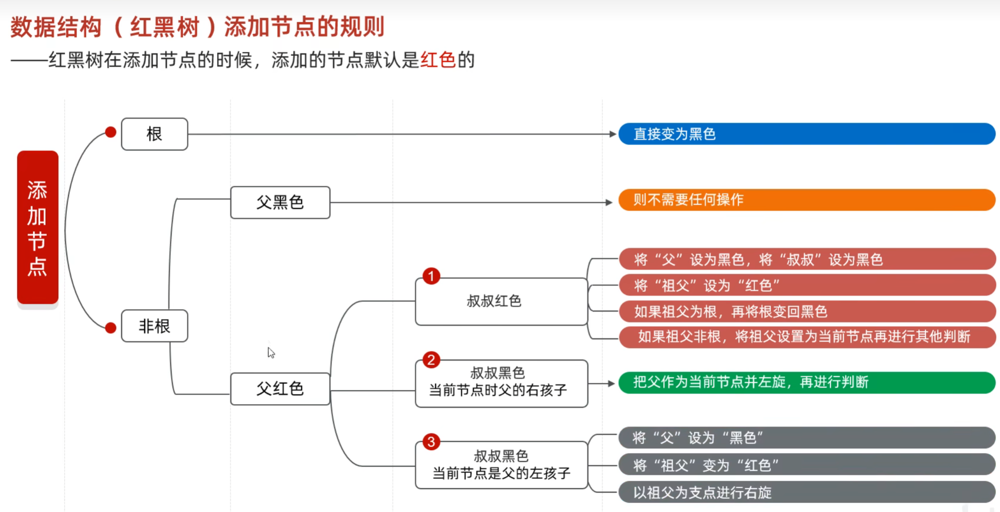

# 红黑树

>[!优点]
>增删改查性能都好

红黑树是一种==自平衡的二叉搜索树==。每个节点额外存储了一个 color 字段 ("RED" or "BLACK")，用于确保树在插入和删除时保持平衡。 
## 一、红黑树的定义

>[!特点]
>1.是一颗二叉查找树
>2.不是高度平衡
>3.特有红黑规则

下图为一棵合法的红黑树：

>[!红黑规则]
>1. 节点为红色或黑色
>2. NIL 节点（空叶子节点）为黑色
>3. 根节点必须是黑色
>4. 红色节点的子节点为黑色(不能出现两个红色节点相连)
>5. 从根节点到 N IL 节点的每条路径上的黑色节点数量相同

红黑树是一种特殊的二叉搜索树，除了满足普通二叉搜索树的性质外（即左子树的值小于根节点，右子树的值大于根节点），还需要满足以下五条性质：

1. **节点是红色或黑色**。
    
    - 每个节点都有一个附加属性表示颜色。
2. **根节点是黑色**。
    
    - 保证从根开始到任何叶子路径上的黑节点个数一致。
3. **所有叶子节点（NIL 节点）是黑色**。
    
    - 叶子节点通常是虚拟的空节点，用于辅助实现树的平衡。
4. **红色节点的子节点必须是黑色**（即不能有两个连续的红色节点）。
    
    - 保证了树的平衡性和局部高度平衡。
5. **从任一节点到其所有后代叶子节点的路径上，黑色节点的数量相同**（黑高，black-height）。
    
    - 黑高定义为从该节点到叶子节点的路径中黑色节点的数量，不包括自身。

---

### 红黑树的作用

红黑树的设计目标是为了在动态操作（插入、删除、查询）过程中，**平衡树的高度**，使得其高度近似为 O(log⁡n)O(\log n)O(logn)。由于插入和删除可能破坏红黑性质，通过**旋转**和**颜色调整**，红黑树能高效恢复平衡。

常见应用包括：

- C++ STL 中的 `map` 和 `set`
- Java 的 `TreeMap` 和 `TreeSet`
- Linux 内核中使用的红黑树

---

## 二、红黑树的性质分析

红黑树的核心思想是利用颜色规则限制树的不平衡程度，以下是一些性质推导：

1. **树的黑高与最短路径长度**
    
    - 每条从根到叶子的路径都包含相同数量的黑色节点，因此红黑树中最短路径为“全黑”。
2. **树的最大高度（红黑树的平衡性）**
    
    - 最坏情况下，红黑树中最长路径上的红节点和黑节点交替出现，最长路径的长度是最短路径的 2 倍。
    - 最长路径的高度最多为 2⋅log⁡2(n+1)2 \cdot \log_2(n+1)2⋅log2​(n+1)，因此红黑树的高度始终保持在 O(log⁡n)。
3. **复杂度保证**
    - 搜索：O(log⁡n)
    - 插入：O(log⁡n)（需要最多 2 次旋转来恢复平衡）
    - 删除：O(log⁡n)（需要最多 3 次旋转来恢复平衡）

---

## 三、插入节点的规则

 [黑马红黑规则视频](https://www.bilibili.com/video/BV17F411T7Ao?t=1450.1&p=196)

