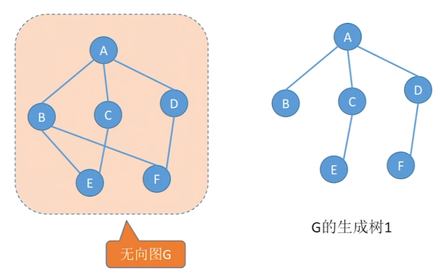

## 生成树（Spanning Tree）

>[!warning] 注意：
>只有连通图才有生成树，而对于非连通图，只存在生成森林。
### 生成树定义
- 对于一个无向连通图 G=(V,E)生成树是 G 的一个**连通子图**，包含 G 中的所有节点，但只用最少的边数连接这些节点，并且没有环。
- 如果一个图有 n 个节点，那么它的生成树一定有 n−1 条边。


---

### **生成树的性质**

1. **连通性**：
    - 生成树包含原图的所有节点，并且是连通的。
2. **边数为 n−1**：
    - 对于一个包含 n 个节点的生成树，其边数为 n-1。
3. **无环性**：
    - 生成树中没有环。如果生成树中增加一条边，就会形成环。
4. **可能有多种生成树**：
    - 如果图中有多个连通的方案，则生成树可能不唯一。

---

### **最小生成树（Minimum Spanning Tree, MST）**

- **最小生成树**是在生成树的基础上，进一步要求总权值最小的生成树。
- **MST 主要算法**：
    - **Prim 算法**：从一个节点开始构造，逐步将权值最小的边加入生成树。
    - **Kruskal 算法**：对所有边按权值排序，逐步加入生成树，同时避免环。

---

### **生成树与最小生成树的区别**

| **特性**   | **生成树**  | **最小生成树**             |
| -------- | -------- | --------------------- |
| **权值**   | 不关注边的权值  | 要求生成树的边权值之和最小         |
| **是否唯一** | 可能有多种生成树 | 如果权值不同，则 MST 是唯一的     |
| **应用场景** | 用于保持连通性  | 用于最优路径设计，如网络、通信、电路优化等 |

---

### **生成树的构造方法**

#### **1. 深度优先搜索（DFS）**
- 如果图中没有权值，只需要保证连通性即可。
- 用深度优先搜索可以简单构造生成树。

**步骤**：

1. 从任意一个节点开始搜索。
2. 遇到未访问的节点时，将边加入生成树，并递归搜索。
3. 最终构造出一棵树。

**时间复杂度**：O(V+E)，其中 V 是节点数，E 是边数。

---

#### **2. 广度优先搜索（BFS）**

- 和 DFS 类似，也可以用广度优先搜索构造生成树。

**步骤**：

1. 从任意一个节点开始，初始化一个队列。
2. 每次从队列中取出一个节点，访问它的邻接节点。
3. 如果邻接节点未被访问，将边加入生成树，并将节点加入队列。
4. 最终构造出一棵树。

**时间复杂度**：O(V + E)。

---

## [最小生成树(MST, Minimum Spanning Tree)](https://oi-wiki.org/graph/mst/)

最小生成树是**加权无向图**的一种子图，它满足以下条件：

1. 包含图中所有的节点。
2. 是一棵树（无环连通图）。
3. 权值之和最小。

最小生成树常用于优化网络（如通信网络、电路设计、运输网络）中的连接成本。


---

### 最小生成树的性质

1. **边数为节点数减一**：
    - 一个 n 个节点的最小生成树有 n-1 条边。
2. **权值和最小**：
    - 最小生成树的边权值之和小于或等于图中任何其他生成树的边权值之和。
3. **无环性**：
    - 最小生成树不能包含环，因为包含环的生成树必然不是最优的（可以去掉环中的较大权值边）。
4. **唯一性**：
    - 如果所有边的权值都不同，则最小生成树是唯一的。
    - 如果权值有重复，则可能存在多个最小生成树。

---

### 常见算法

求解最小生成树的两种经典算法是 **Kruskal 算法** 和 **Prim 算法**。

---

#### **1. Kruskal 算法**

##### **算法思想**
- 按照边的权值 **从小到大** 排序。
- 依次选择 **权值最小的边** ，判断是否会形成环：
    - 如果不会形成环，则将该边加入最小生成树；
    - 如果会形成环，则跳过该边。
- 重复此过程，直到最小生成树的边数为 n-1（即节点数减一）。

>[!tip] 本质
>贪心地选最小边

动图演示：


##### **步骤**
1. 初始化最小生成树为空。
2. 将图中的所有边按权值升序排序。
3. 遍历排序后的边：
    - 如果该边的两个端点属于不同的连通分量（使用并查集判断），将该边加入最小生成树。
    - 合并两个端点所在的连通分量。
4. 当最小生成树的边数达到 n-1 时，算法结束。

##### **时间复杂度**

- **边排序**：$O(Elog⁡E)$，其中 E 是边数。
- **并查集操作**：近似为 $O(E)$。
- 总复杂度：$O(E \log E)$。

##### **适用场景**

- Kruskal 算法适用于稀疏图（即边数远小于节点数的图）。

##### **伪代码**

```python
function Kruskal(graph):
    MST = []  # 最小生成树
    edges = graph.edges  # 获取所有边
    sort(edges, by weight)  # 按权值升序排序
    initialize disjoint set  # 初始化并查集

    for edge in edges:
        if edge.u and edge.v are in different sets:
            MST.add(edge)  # 将边加入最小生成树
            union(edge.u, edge.v)  # 合并两个集合

        if MST has (n-1) edges:
            break

    return MST
```

---

#### **2. Prim 算法**

##### **算法思想**
- 从一个初始节点出发，逐步将权值最小的边连接的节点加入生成树，直到所有节点都被包含在生成树中。

>[!tip] 本质
>贪心算法地找最小权顶点

动态演示：


##### **步骤**

1. 初始化一个空的最小生成树。
2. 从任意一个节点开始，将其加入生成树。
3. 重复以下过程：
    - 找出与生成树中节点相连的所有边中，权值最小的边。
    - 将该边及其另一端点加入生成树。
4. 直到所有节点都加入生成树。

##### **实现方式**
- 使用**优先队列**（小顶堆）加速寻找权值最小的边。
##### **时间复杂度**

- 使用邻接矩阵：$O(V^2)$，适用于稠密图。
- 使用邻接表和优先队列：$O(E \log V)$，适用于稀疏图。

##### **适用场景**
- Prim 算法适用于稠密图（即边数接近节点数平方的图）。
##### **伪代码**

```python
function Prim(graph):
    MST = []  # 最小生成树
    visited = set()  # 已加入生成树的节点
    min_heap = []  # 最小堆，存储权值最小的边
    start_node = arbitrary node
    add all edges from start_node to min_heap

    while min_heap is not empty:
        weight, u, v = extract_min(min_heap)  # 获取权值最小的边
        if v not in visited:
            MST.add((u, v, weight))  # 将边加入最小生成树
            visited.add(v)  # 将节点 v 加入生成树
            add all edges from v to min_heap

    return MST
```

---

### **举例**

#### 图的邻接表表示：

```
节点 | 相邻节点（边的权值）
 A   | B(1), C(3)
 B   | A(1), C(2), D(4)
 C   | A(3), B(2), D(5)
 D   | B(4), C(5)
```

#### **Kruskal 算法求解**

1. 按权值排序边：$\{(A,B,1), (B,C,2), (A,C,3), (B,D,4), (C,D,5)\}$。
2. 初始化并查集，每个节点自成集合。
3. 遍历边：
    - (A,B,1)：加入树，集合变为 \{AB, C, D\}。
    - (B,C,2)：加入树，集合变为 \{ABC, D\}。
    - (A,C,3)：跳过（形成环）。
    - (B,D,4)：加入树，集合变为 \{ABCD\}。
4. 最小生成树：{(A,B,1), (B,C,2), (B,D,4)\}，权值和为 7。

---

#### **Prim 算法求解**

1. 从 A 开始，将边$\{(A,B,1), (A,C,3)\}$ 加入最小堆。
2. 选择 (A,B,1)，加入树，当前节点为 B。
3. 将 B 的边加入堆：\{(A,C,3), (B,C,2), (B,D,4)\}。
4. 选择 (B,C,2)，加入树，当前节点为 C。
5. 将 C 的边加入堆：\{(A,C,3), (B,D,4), (C,D,5)\}。
6. 选择 (B,D,4)，加入树，当前节点为 D。
7. 所有节点已加入，算法结束。
8. 最小生成树：{(A,B,1), (B,C,2), (B,D,4)\}，权值和为 7。

---

### **实际应用**

1. **网络设计**：
    - 如通信网络、电路设计、运输网络的优化。
2. **最优路径问题**：
    - 求解村庄之间的最短连接方式。
3. **数据压缩**：
    - 生成哈夫曼树（基于最小生成树思想）。

---

### **总结**

- **Kruskal 算法**：边权值排序后逐步构建树，适合稀疏图。
- **Prim 算法**：从某一点出发逐步扩展树，适合稠密图。

选择算法的关键在于图的稀疏程度和实现环境。两种算法都可以高效地找到最小生成树。


