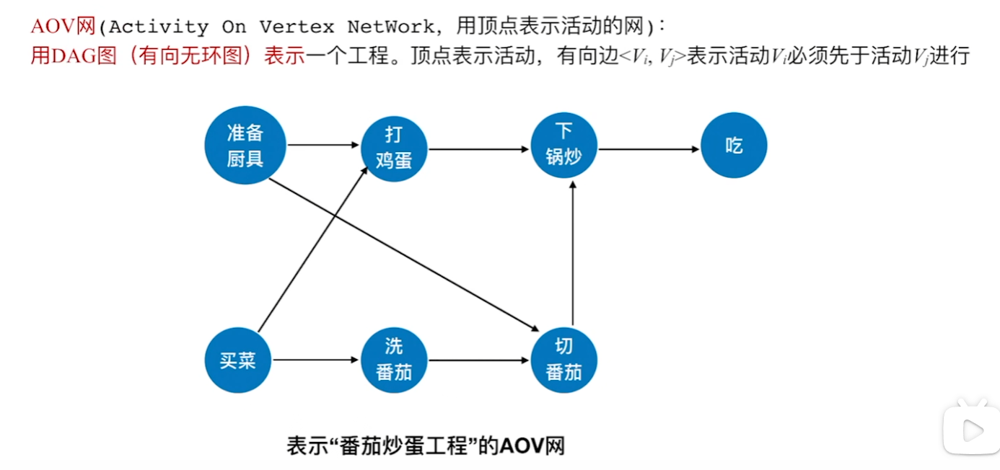

# 有向无环图

## [有向无环图](https://oi-wiki.org/graph/dag/)
### 定义
边有向，无环。

英文名叫 Directed Acyclic Graph，缩写是 DAG。

### 性质

- 能 [拓扑排序](https://oi-wiki.org/graph/topo/) 的图，一定是有向无环图；
    如果有环，那么环上的任意两个节点在任意序列中都不满足条件了。

- 有向无环图，一定能拓扑排序；
    （归纳法）假设节点数不超过的有向无环图都能拓扑排序，那么对于节点数等于的，考虑执行拓扑排序第一步之后的情形即可。

## [拓补排序](https://oi-wiki.org/graph/topo/)

### AOV网

#### **1. 什么是AOV网络？**

AOV 网络（Activity on Vertex Network）是一种通过有向图表示活动之间先后顺序的网络。它是一种**有向无环图（DAG, Directed Acyclic Graph）**，用于描述活动之间的优先关系。

- **节点（Vertex）：** 每个节点表示一个活动。
- **有向边（Directed Edge）：** 边 (u, v) 表示活动 u 必须在活动 v 之前完成，也就是 u 是 v 的前置活动。

---

#### **2. AOV网络的特点**

1. **无环性：** AOV 网络中不存在环。如果存在环，则无法定义活动的完成顺序。
2. **有向性：** 每条边都有方向，表示活动之间的前后关系。
3. **多个拓扑序：** 当存在多个节点之间没有直接依赖关系时，可以有多个拓扑排序序列。

---
### 拓扑排序
#### **1. 什么是拓扑排序？**

拓扑排序（Topological Sorting）是针对**有向无环图（DAG）**的所有顶点的一种线性排序，使得对于图中的每一条有向边 (u,v)(u, v)，顶点 uu 都排在顶点 vv 的前面。

拓扑排序在很多实际应用中非常重要，例如：

- **任务调度：** 排列活动的顺序，使得所有的依赖关系得到满足。
- **课程安排：** 如果一门课程依赖于另一门课程，则必须先完成前置课程。
- **构建系统依赖：** 一个模块的构建可能依赖于其他模块。

---

#### **2. 拓扑排序的基本思想**

拓扑排序的核心在于：

- 通过检查图中每个顶点的**入度（in-degree）** 来安排顶点的顺序。
- 入度表示有多少条边指向该顶点。
- **入度为 0 的顶点表示没有前置依赖的活动，可以优先完成。**

---

#### **5. 拓扑排序的算法步骤**

##### **方法一：基于入度的算法**

1. **初始化入度：** 对每个顶点计算其入度。
2. **选择入度为 0 的顶点：** 找到所有入度为 0 的顶点，将它们加入拓扑序列中，并移除它们。
3. **更新入度：** 删除入度为 0 的顶点后，更新其所有相邻顶点的入度（对应移除出边）。
4. **重复：** 重复步骤 2 和 3，直到图中所有顶点被处理完。如果处理完成后图中仍然存在顶点，说明图中存在环，无法进行拓扑排序。

##### **方法二：深度优先搜索（DFS）**

1. **递归遍历：** 从任意未访问的顶点出发，递归访问其所有后继顶点。
2. **逆序输出：** 当一个顶点的所有后继顶点都被访问后，将该顶点加入结果序列。
3. **检测环：** 如果图中有环，DFS 会出现重复访问的现象，可以用访问标记检测。

---

#### **6. AOV网络的实际应用**

1. **项目管理：** AOV 网络在项目管理中用来表示任务之间的依赖关系，例如某任务必须在另一任务之前完成。
2. **软件编译：** 编译系统用拓扑排序来决定模块的编译顺序，确保所有依赖关系得到满足。
3. **任务调度：** 多任务系统可以利用拓扑排序来确定任务的执行顺序。
